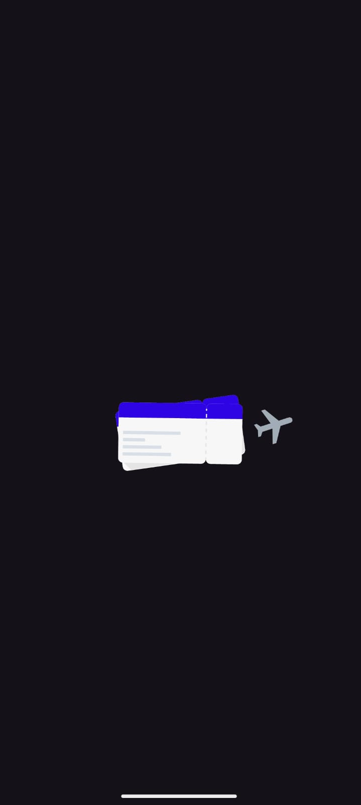
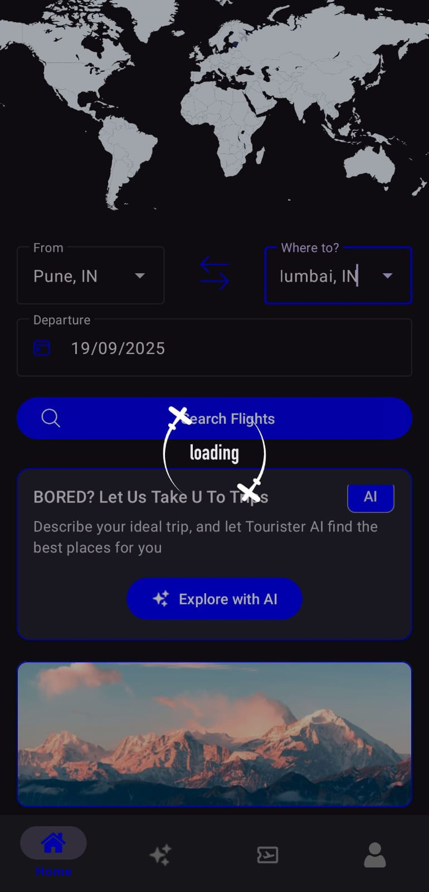
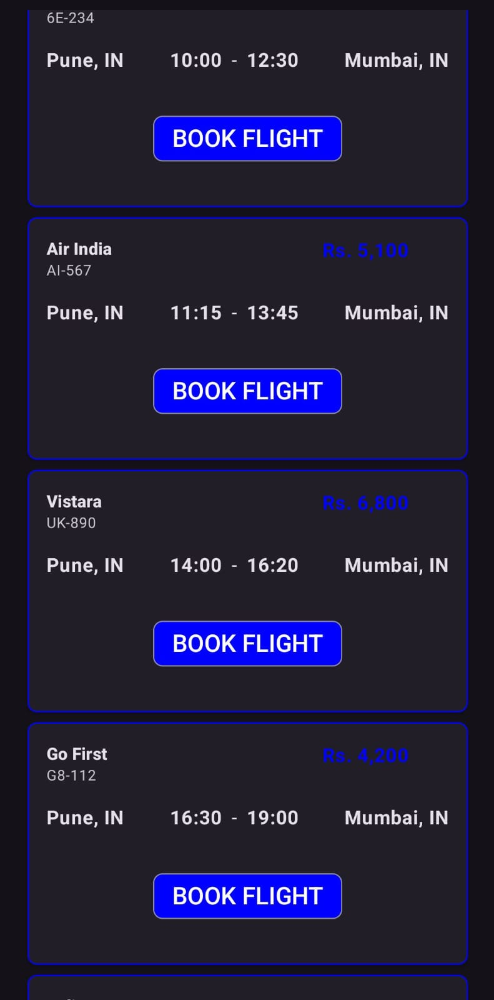
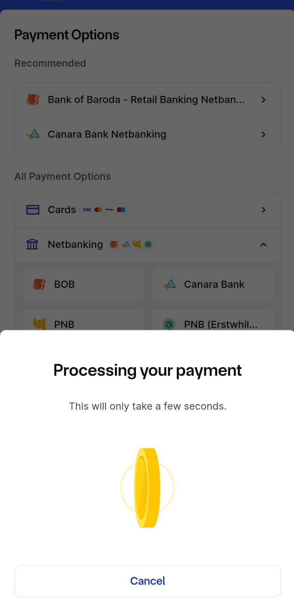
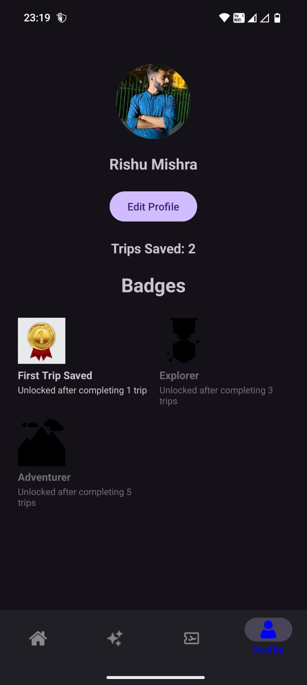
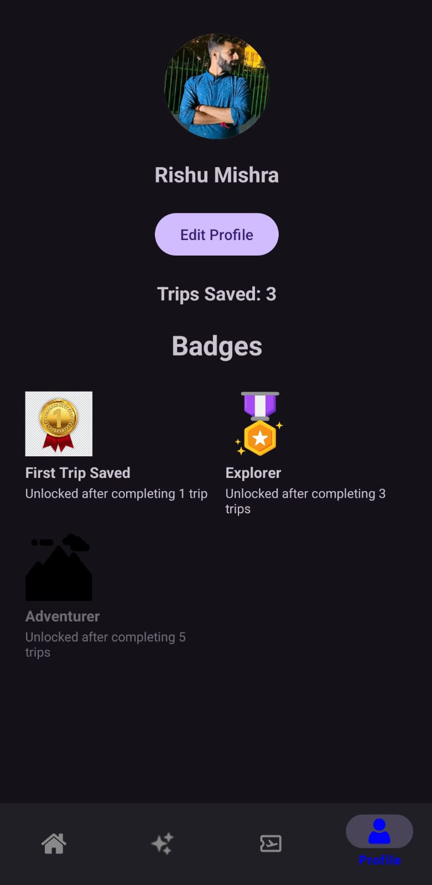
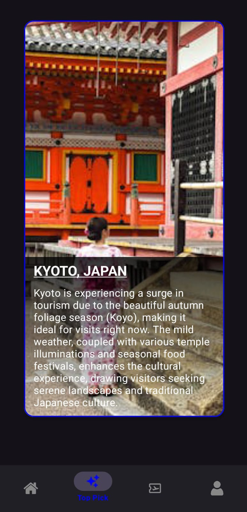
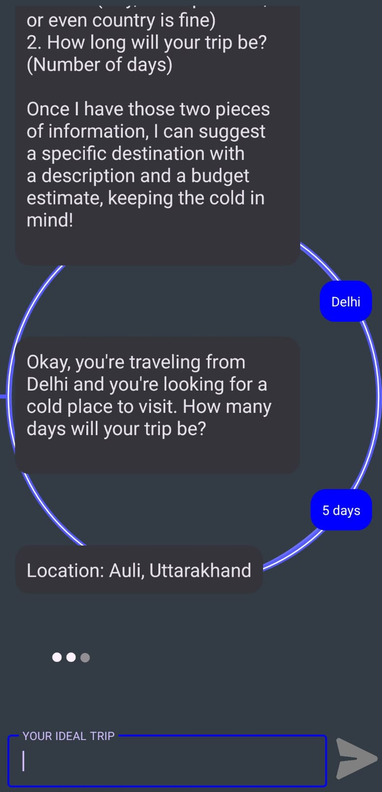
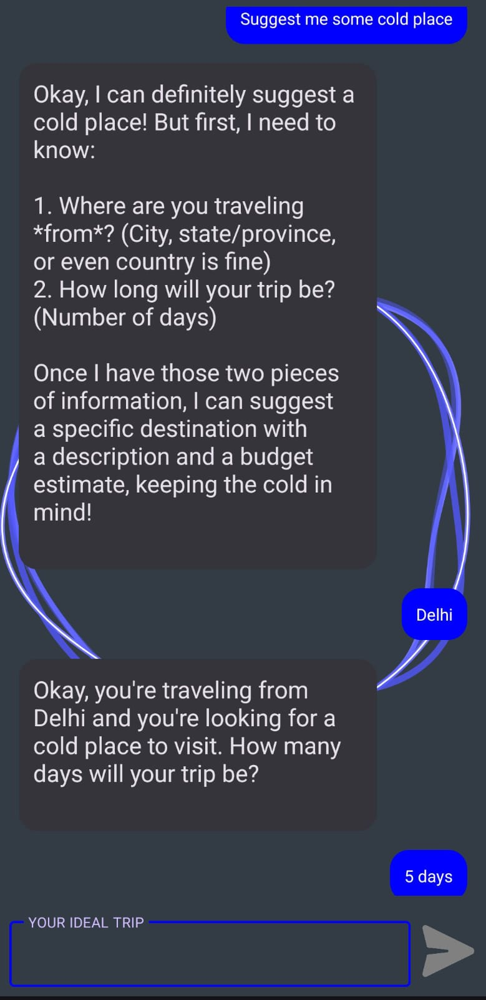
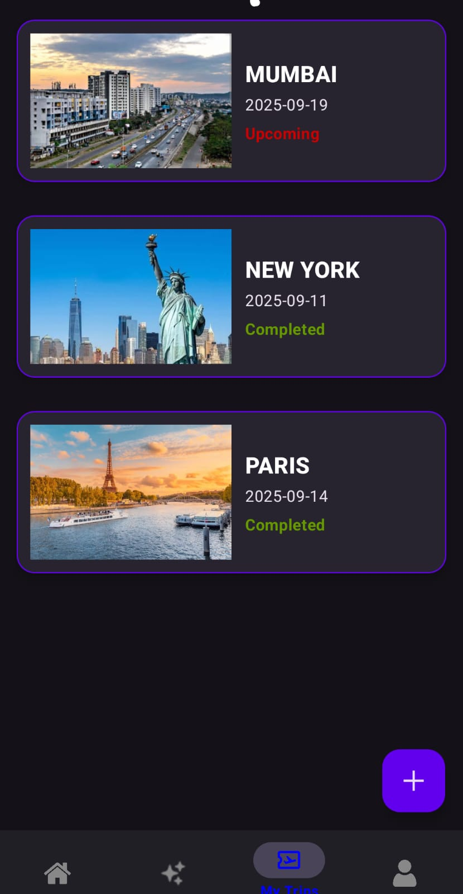

✈️ Tourister App

A modern and minimal travel booking application built with Kotlin (Android) and FastAPI (Python).
This app allows users to search, book, and manage flights, while also exploring AI-powered trip suggestions and tracking their travel achievements.

🌍 Features

🔍 Flight Search — Find flights between any two cities with live data.

💳 Secure Payments — Integrated payment gateway for smooth booking experience.

🧠 AI Trip Suggestions — Get personalized travel recommendations powered by FastAPI backend and AI.

🏅 Achievements & Badges — Unlock badges like First Trip Saved, Explorer, and Adventurer as you travel.

📅 Trip Management — View upcoming and completed trips with detailed itinerary info.

👤 User Profile — Manage profile, view stats, and see unlocked badges.

🖼️ App Screenshots
<h2 align="center">✨ App Screenshots</h2>

  <em>From flight search to AI-powered trip planning — a glimpse of the complete travel experience.</em>

  
  
  

  
  
  

  
  
  

  

	
🛠️ Tech Stack

Frontend (Android App)

💻 Language: Kotlin,XML

🧩 Architecture: MVVM 

🌐 Networking: Retrofit2 + Coroutines

💾 Local Storage: Room Database

🎨 UI Design: Material3 + XML (Dark Theme Support)

Backend (API Server)

⚙️ Framework: FastAPI (Python 3.11)

🗃️ Database: PostGres

🔒 Auth: JWT

🤖 AI Services: Integrated OpenAI API for destination recommendations

🚀 Hosting: Render 

🚀 Future Enhancements

🏨 Hotel & stay booking integration

📍 Real-time flight tracking

👥 Group travel planning & shared itineraries

🗺️ AI-based budget planner
